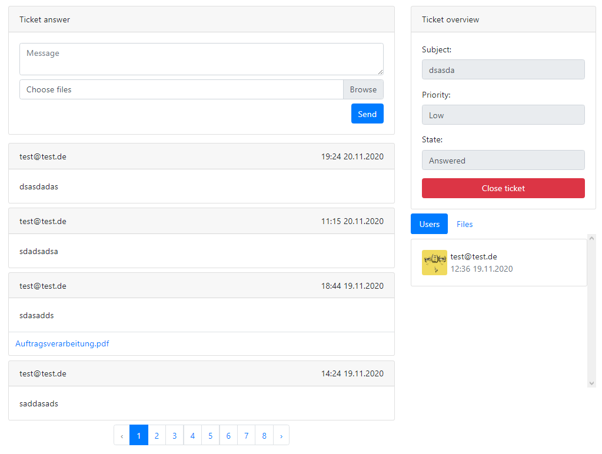
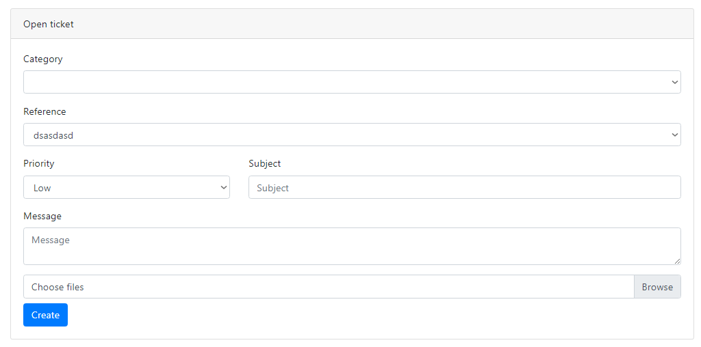
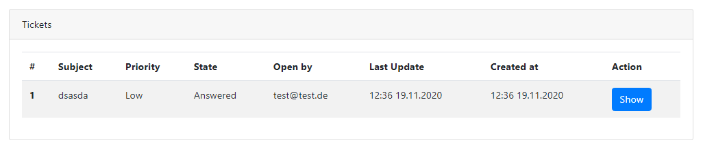

# Laravel Tickets

[](https://packagist.org/packages/rexlmanu/laravel-tickets)
[](https://travis-ci.org/rexlmanu/laravel-tickets)
[](https://scrutinizer-ci.com/g/rexlmanu/laravel-tickets)
[](https://packagist.org/packages/rexlmanu/laravel-tickets)

Simple but effective solution to provide support. Due to its lightweight construction, it fits into any project. In addition, it offers a wide range of configuration options from the start and is therefore suitable for any area.

## Features

- Highly configurable
- auto closing
- file upload support
- permission support
- ticket categories
- priority
- easy to customize
- uuid support
- declare ticket reference
- multiple language support

## Preview

Ticket list:

Ticket creation:

Ticket show:


## Todos

- Improve documentation
- tailwind and vue frontend
- admin ticket scaffold
- unit tests

## Installation

You can install the package via composer:

```bash
composer require rexlmanu/laravel-tickets
```

After the installation
```bash
php artisan vendor:publish --provider=RexlManu\LaravelTickets\LaravelTicketsServiceProvider
```

## Documentation

Currently the views are only implemented for bootstrap. After publishing, you should implement the layouts.

The trait ``HasTickets`` should be added to the user model
```php

use RexlManu\LaravelTickets\Traits\HasTickets;

class User
{
    use HasTickets; // important for laravel-tickets
}
```

The ticket routes can be implemented via the macro
```php

use Illuminate\Routing\Controller;
use RexlManu\LaravelTickets\Controllers\TicketControllable;

class TicketController extends Controller {

  use TicketControllable;

}

Route::tickets( TicketController::class );
```

For ticket referneces
```php

use Illuminate\Database\Eloquent\Model;
use RexlManu\LaravelTickets\Interfaces\TicketReference;
use RexlManu\LaravelTickets\Traits\HasTicketReference;

class ExampleModel extends Model implements TicketReference {

  use HasTicketReference;

  // Check if user has access to this model
  function hasReferenceAccess() : bool {
      return request()->user()->user_id == $this->user_id;
  }

}

```
Add this model to the list of reference models now
and Then you should see this model as reference

Config: All points of the configuration are documented.

### Testing

``` bash
composer test
```

## Contributing

Please see [CONTRIBUTING](CONTRIBUTING.md) for details.

### Security

If you discover any security related issues, please email rexlmanude@gmail.com instead of using the issue tracker.

## Credits

- [Emmanuel Lampe](https://github.com/rexlmanu)
- [René Roscher](https://github.com/rene-roscher)
- [All Contributors](../../contributors)

## License

The MIT License (MIT). Please see [License File](LICENSE.md) for more information.
